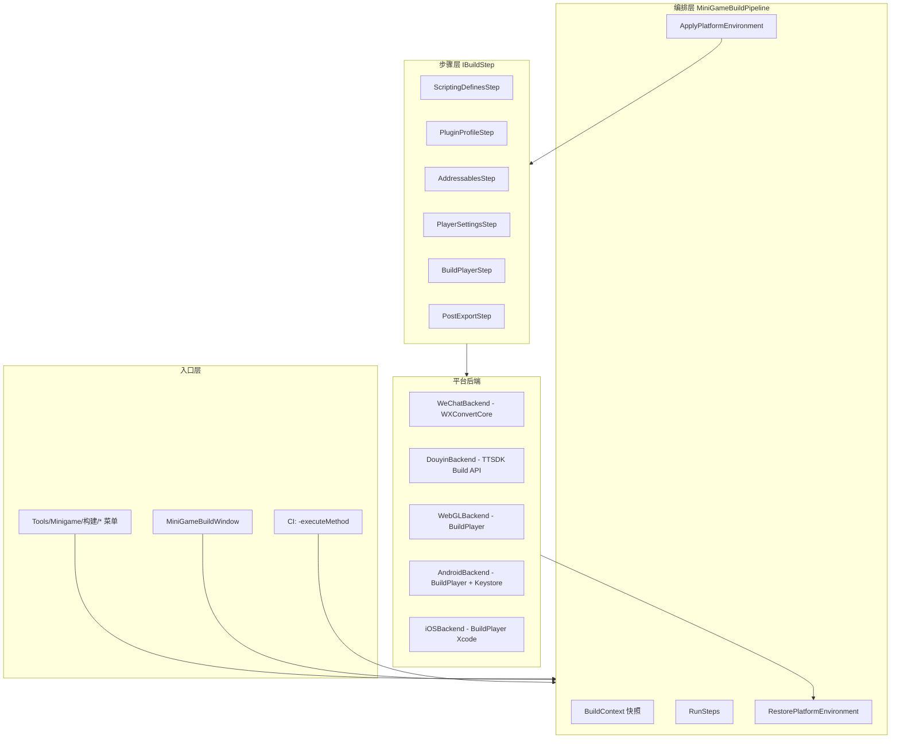

# 多端打包架构方案（草案 v0.1）

> **状态**：已确认（1A 2A 3A 4A + GitHub Actions）— Phase 1–3 已落地，见 `ci-github-actions.md`  
> **约束**：Unity **2022.3**（不用团结）、同仓共存微信 + 抖音插件  
> **目标平台**：微信小游戏、抖音小游戏、WebGL、Android、iOS  

---

## 1. 背景与问题

| 问题 | 说明 |
|------|------|
| 宏常驻污染 | WebGL 长期挂 `WEIXINMINIGAME` 会导致打抖音/WebGL 时误编微信分支（**已移除常驻宏**） |
| 双插件同仓 | 微信 SDK 大量代码在 `UNITY_WEBGL` 下即参与编译；抖音有独立 jslib / 模板，与微信 WebGL 钩子可能冲突 |
| 构建入口不一 | 微信必须 `WXConvertCore.DoExport`；抖音在 2022.3 上应走 **TTSDK/BGDT 官方构建**，不能与普通 WebGL 混用 |
| 宏需互斥 | `WEIXINMINIGAME` 与 `DOUYINMINIGAME` 不得同时存在 |

---

## 2. 设计原则

1. **构建时注入、构建后还原**：平台宏、插件启用状态、WebGL 模板仅在构建生命周期内切换。  
2. **一端一流水线**：每个 `BuildTarget` 有独立 `IBuildStep` 序列，禁止「一个 BuildPlayer 打天下」。  
3. **业务零感知构建细节**：游戏代码只依赖 `MiniGameKit` / `AdManager` + `#if WEIXINMINIGAME` / `DOUYINMINIGAME`。  
4. **Editor 日常无平台宏**：默认 Standalone/WebGL/Android/iOS 均不挂小游戏宏；本地测某端时通过菜单临时启用（互斥）。  
5. **CI 与 Editor 同代码路径**：`MiniGameBuildPipeline` 为唯一编排入口。

---

## 3. 总体架构



### 3.1 核心类型（拟新增/重构）

| 类型 | 职责 |
|------|------|
| `BuildFlavor` | 枚举：`WeChatMiniGame`, `DouyinMiniGame`, `WebGL`, `Android`, `iOS`（沿用现有 `BuildPlatform` 可改名对齐） |
| `BuildContext` | 一次构建的不可变配置 + 可变快照（宏、输出路径、是否 Development） |
| `EnvironmentSnapshot` | 构建前保存的 `ScriptingDefineSymbols`、关键 `PlayerSettings`、插件 Profile 名 |
| `IBuildStep` | `bool Execute(BuildContext ctx)` / `void Rollback` |
| `IPlatformBackend` | 平台专属「最后一步导出」（微信 DoExport、抖音 Stark Build、原生 BuildPlayer） |
| `PluginProfile` | 描述某 Flavor 下哪些目录的 PluginImporter 对 WebGL 启用/禁用 |

---

## 4. 平台宏策略

### 4.1 互斥宏（仅构建期或临时调试）

| 宏 | 写入时机 | 作用域 |
|----|----------|--------|
| `WEIXINMINIGAME` | 微信构建 `Apply` | 建议 **仅 WebGL** BuildTargetGroup |
| `DOUYINMINIGAME` | 抖音构建 `Apply` | 建议 **仅 WebGL** BuildTargetGroup |

**日常 Editor / 未构建**：所有 TargetGroup **均不含**上述两宏（当前 WebGL 已改为仅 `TextMeshPro`）。

### 4.2 AdDefineSymbols 改造（待实施）

- `启用微信` → 先移除 `DOUYINMINIGAME`，再添加 `WEIXINMINIGAME`  
- `启用抖音` → 先移除 `WEIXINMINIGAME`，再添加 `DOUYINMINIGAME`  
- 新增 `清除所有小游戏宏` 菜单  

---

## 5. 各平台构建流水线（2022.3）

### 5.1 微信小游戏

| 步骤 | 内容 |
|------|------|
| 1 | 快照环境 |
| 2 | `PluginProfile.WeChat`：启用 WX jslib，禁用抖音 WebGL jslib（可选，见 §7） |
| 3 | WebGL 仅加 `WEIXINMINIGAME` |
| 4 | Addressables → `WXAssetBundleProvider` + 构建内容 |
| 5 | `WebGLCiBuild.ApplyReleaseSizeOptimizations()`（微信模板） |
| 6 | **`WeChatWASM.WXConvertCore.DoExport(true)`**（生成并转换） |
| 7 | 还原宏与插件 Profile |

**输出**：微信插件配置的 `DST` 目录（非 `build/WeChatMiniGame` 路径为准）。

### 5.2 抖音小游戏（2022.3，非团结）

| 步骤 | 内容 |
|------|------|
| 1 | 快照环境 |
| 2 | `PluginProfile.Douyin`：禁用 WX WebGL jslib，启用 TT jslib |
| 3 | WebGL 仅加 `DOUYINMINIGAME` |
| 4 | Addressables → **Unity 默认 Provider**（不用 WX Provider） |
| 5 | **不**应用微信 WebGL 模板优化 |
| 6 | 调用 **TTSDK 官方构建 API**（`API.BuildManager` / BGDT 面板同等逻辑，需封装 `DouyinBackend`） |
| 7 | 还原环境 |

> **注意**：不再使用「仅 `BuildPlayer` + 抖音宏」作为正式抖音出口；与微信 `DoExport` 对称。

### 5.3 WebGL（H5 / 非小游戏宿主）

| 步骤 | 内容 |
|------|------|
| 1 | 移除 `WEIXINMINIGAME` / `DOUYINMINIGAME` |
| 2 | `PluginProfile.WebGL`：可按需禁用双端小游戏 jslib |
| 3 | 默认 Addressables Provider |
| 4 | `ApplyReleaseSizeOptimizations` 使用 **可配置模板**（非强制微信模板） |
| 5 | `BuildPipeline.BuildPlayer` → `build/WebGL` |

### 5.4 Android

| 步骤 | 内容 |
|------|------|
| 1 | 无小游戏宏 |
| 2 | `AndroidKeystoreConfigurator.ApplyIfConfigured()` |
| 3 | IL2CPP / 架构按项目现有设置 |
| 4 | `BuildPlayer` → `build/Android/{ProductName}.apk` |
| 5 | 可选 `AutoRun` |

### 5.5 iOS

| 步骤 | 内容 |
|------|------|
| 1 | 无小游戏宏 |
| 2 | `BuildPlayer` → `build/iOS`（Xcode 工程） |
| 3 | 后续签名 / Archive 在 Xcode 或 CI macOS 节点完成 |

---

## 6. 插件共存：PluginProfile（建议实施）

同仓保留 `Assets/WX-WASM-SDK-V2` 与 `Plugins/ByteGame`，通过 **构建前切换 PluginImporter** 降低链接冲突：

| Profile | WebGL 上 WX jslib | WebGL 上 TT jslib |
|---------|-------------------|-------------------|
| WeChat | 启用 | 禁用 |
| Douyin | 禁用 | 启用 |
| WebGL | 可配置（默认禁用双端小游戏 glue） |
| Android / iOS | 不适用 | 不适用 |

实现方式：`PluginProfileStep` 扫描约定目录（可配置 `MiniGameKitEditorPaths`），`AssetDatabase.ImportAsset` 后刷新。

---

## 7. Addressables 策略

| Flavor | Provider |
|--------|----------|
| 微信 | `WXAssetBundleProvider` + `WXBundledAssetProvider` |
| 抖音 / WebGL / 原生 | Unity 默认 `AssetBundleProvider` |

构建前切换，构建后可选择保持或还原（建议 **构建后还原为上次 Profile**，避免 Artist 误提交 Provider 变更）。

---

## 8. 目录与产物约定

```
{ProjectRoot}/
  build/
    WebGL/              # H5
    WeChatMiniGame/     # 辅助/日志（真实导出以微信 DST 为准）
    DouyinMiniGame/     # 抖音官方工具输出
    Android/*.apk
    iOS/                # Xcode 工程
```

CI 产物上传按 Flavor 分 artifact。

---

## 9. Editor 菜单规划（与现网对齐）

```
Tools/Minigame/构建/
  构建窗口                    # 选 Flavor + 选项
  微信小游戏/本地构建          # → WeChatBackend（已有，加固 PluginProfile）
  抖音小游戏/本地构建          # → DouyinBackend（待接 TTSDK API）
  WebGL/本地构建               # 新增或从窗口
  Android/...
  iOS/...
  诊断当前构建环境
  一键性能护航 (微信)          # 保留，仅微信前处理
  Addressables/...            # 保留
```

---

## 10. CI 设计（GitHub Actions / 自建 Agent）

统一参数：

```text
-buildTarget WebGL|Android|iOS
-customBuildPath <path>
-buildFlavor WeChat|Douyin|WebGL   # 新增，或由 executeMethod 区分
```

| Job | executeMethod | 说明 |
|-----|---------------|------|
| webgl-h5 | `MiniGameKit.Editor.CiBuild.BuildWebGL` | 纯 H5 |
| wechat | `MiniGameKit.Editor.CiBuild.BuildWeChat` | 微信「生成并转换」 |
| douyin | `MiniGameKit.Editor.CiBuild.BuildDouyin` | TTSDK 反射构建 |
| android | `MiniGameKit.Editor.CiBuild.BuildAndroid` | APK |
| ios | `MiniGameKit.Editor.CiBuild.BuildIOS` | Xcode 工程（macOS Runner） |

每个 Job：**单 Flavor、单宏、构建后 fail-fast 检查输出目录**。

---

## 11. 业务代码规范（与构建配套）

| 规则 | 示例 |
|------|------|
| 平台 API 必须宏包裹 | `#if WEIXINMINIGAME` 再调 `WX.*` |
| 统一门面 | 对外只用 `MiniGameKit` / `AdManager` |
| 存储 | `UserInfo` 已分微信 `PlayerPrefs` / 抖音 `TTSDK.PlayerPrefs` |
| 启动上报 | `WXReportGameStart` 仅微信宏内调用（`GameControl` 待改） |

---

## 12. 实施分期（确认后执行）

### Phase 0 — 已完成

- [x] 移除 WebGL 常驻 `WEIXINMINIGAME`  
- [x] 方案评审（1A 2A 3A 4A + GHA 子仓库）

### Phase 1 — 已完成

- [x] `BuildEnvironmentScope`（宏 / PluginProfile / Addressables 快照还原）  
- [x] `AdDefineSymbols` 互斥 + 「清除所有小游戏宏」  
- [x] `BuildPluginProfileManager`（WeChat / Douyin / WebGL）  
- [x] `build-pipeline.md` / `ci-github-actions.md`

### Phase 2 — 已完成

- [x] `DouyinBuildBackend`（反射 `BuildManager.*`）  
- [x] `RunDouyinBuild` 替换纯 WebGL BuildPlayer  
- [x] `CiBuild.BuildDouyin`

### Phase 3 — 已完成

- [x] `Tools/Minigame/构建/WebGL/本地构建`  
- [x] `CiBuild` 五端入口 + `BuildCiManifest`  
- [x] `.github/workflows/build-unity.yml` + `scripts/ci/sync-build-repo.*`

### Phase 4 — 待办

- [ ] `GameControl.WXReportGameStart` 等加 `#if WEIXINMINIGAME`  
- [ ] 构建诊断增强（PluginProfile / 插件版本一览）  
- [ ] 创建远程仓库 `OutbreakBowling-build` 并添加 submodule  

---

## 13. 待你确认的问题

请回复选项或补充说明，确认后按 Phase 1 起执行代码改动。

1. **抖音构建入口（2022.3）**  
   - A) 以 **BGDT 窗口** 同款 API（`API.BuildManager.BuildForTuanjie` 在 2022.3 的等价物）自动化  
   - B) 暂时保留「WebGL BuildPlayer + 抖音宏」，仅加 PluginProfile，官方转换仍手工  
   - C) 其它（请说明你们当前在用的抖音打包面板名称）

2. **PluginProfile 是否默认开启**  
   - A) 构建时自动切换 jslib（推荐）  
   - B) 仅文档约定，构建不自动改 PluginImporter  

3. **WebGL H5 模板**  
   - A) 继续用现有 `PROJECT:WYMinigame2022`  
   - B) 使用 Unity 默认 WebGL 模板  
   - C) 项目另有模板路径  

4. **Addressables 构建后是否还原 Provider**  
   - A) 还原（推荐，避免误提交）  
   - B) 保持构建时 Provider  

5. **CI 环境**  
   - 是否已有 GitHub Actions / Jenkins？是否需在方案中包含 **Windows 编 WebGL + macOS 编 iOS** 的双机策略？

---

## 14. 变更记录

| 日期 | 说明 |
|------|------|
| 2026-05-28 | 草案 v0.1；移除 WebGL 常驻 `WEIXINMINIGAME` |
